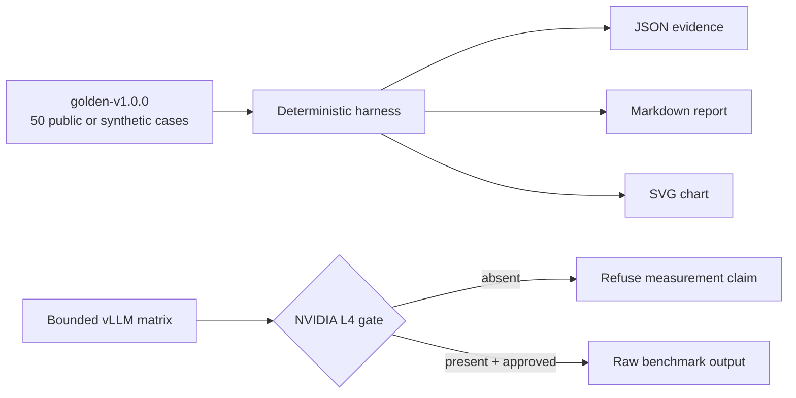

# Architecture dossier

The deterministic track catches contract regressions without network calls or nondeterministic model behavior. The GPU track measures performance separately and retains raw evidence. A deterministic pass is not evidence of model quality, and a local Mac smoke test is not evidence of L4 performance.

## Failure semantics

- Invalid dataset counts fail before evaluation.
- Any critical-case regression fails the process.
- Missing L4 hardware refuses benchmark execution rather than emitting zero or placeholder results.
- Raw data remains distinct from derived conclusions.

## Security and limitations

All cases are synthetic and contain no employer or JobsApply data. The policy cases demonstrate deterministic dispositions, not universal prompt-injection prevention. The retrieval cases exercise a small lexical reference implementation, not production semantic retrieval. Model and hardware conclusions remain unverified until the bounded L4 run is explicitly approved and executed.
